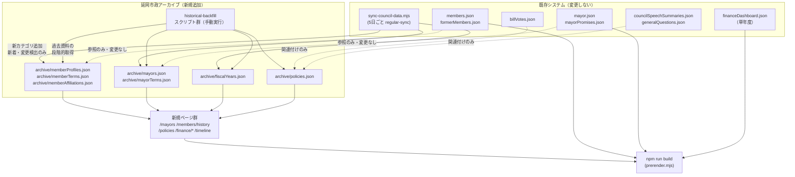
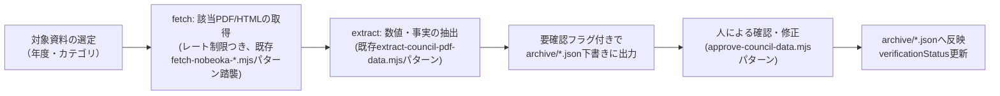
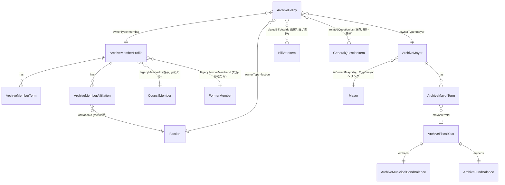
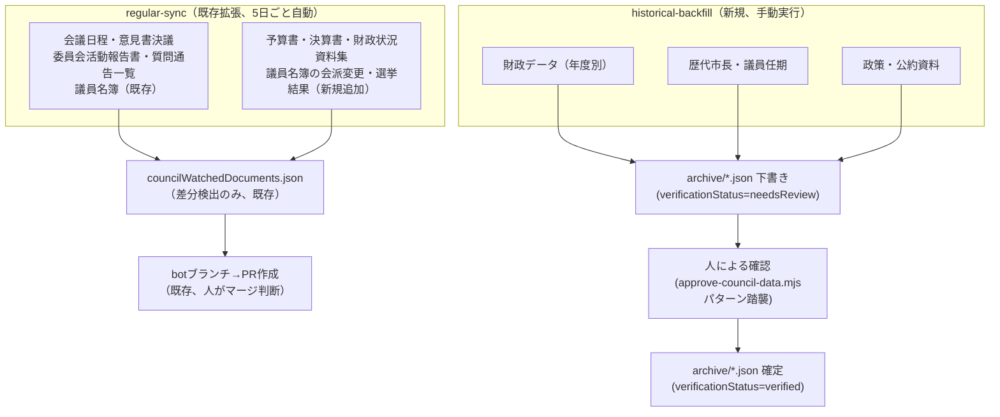

# 延岡市政アーカイブ 拡張設計（フェーズ1：調査・設計）

作成日：2026-08-04
ステータス：フェーズ1（設計）・フェーズ2（歴代市長基盤）・フェーズ3（財政データ基盤）・
フェーズ4（比較・グラフ基盤）・フェーズ5（過去議員アーカイブ基盤）・
フェーズ6（政策データ・政策比較基盤、型・データ・一覧・詳細・比較画面のみ）実装済み。
フェーズ6の`scripts/validate-data.mjs`参照整合性チェック・検索インデックス連携は次回対応
（下記フェーズ6節参照）。自動巡回拡張は未着手。
関連文書：[historical-civic-data-plan-requirements.md](./historical-civic-data-plan-requirements.md)（要件原文）

このドキュメントは、一般質問データ登録（2023-06〜2026-03、全会期完了）の後に着手した
「延岡市政アーカイブ」拡張のフェーズ1成果物である。今回は**調査・設計・型定義案・取得元候補調査のみ**を行い、
実データ登録、画面（ルーティング実装）、大量の過去資料取得は行っていない。

---

## 目次

1. 現在のデータ構造の調査結果
2. システム全体アーキテクチャ
3. データベース（JSON）設計
4. 型定義案（TypeScript）
5. ルーティング設計
6. API・自動取得設計
7. データ移行計画
8. 実装フェーズ一覧
9. リスク・注意事項
10. ER図
11. ディレクトリ構成
12. JSON構造サンプル
13. 自動巡回構成
14. データフロー図
15. 実装優先順位
16. 財政データの単位定義
17. AI分析データの扱い
18. 取得元候補一覧

---

## 1. 現在のデータ構造の調査結果

### 1.1 型定義（`src/types/index.ts`、約1500行）

既存の型は「1エンティティ＝1インターフェース＋出典メタ情報を内包」という一貫した設計になっている。
今回のアーカイブ設計もこの流儀を踏襲する。

| 既存の型 | 役割 |
|---|---|
| `CouncilMember` | 現職議員1名分（プロフィール・SNS・質問・議決・活動報告） |
| `FormerMember` | 元議員1名分の最小限データ（`servedSessions`のみで在職期間を表現、現職集計から除外） |
| `Mayor` | 現市長1名分（`src/data/mayor.json`、単数形。過去の市長は扱っていない） |
| `Pledge` / `MayorPromiseItem` | 市長公約（進捗は事実区分のみ、独自採点なし） |
| `BillVoteItem` / `BillVoteMemberEntry` | 議案ごとの賛否（`verificationStatus`・`publicationStatus`を分離管理） |
| `CouncilSession` / `CouncilDocument` | 定例会・臨時会ごとの資料（`storageType: local/external`で複製可否を区別） |
| `CouncilSpeech` / `CouncilSpeechQuestionItem` | 一般質問・質疑の要約（`summaryStatus`で確認状況を区別、原文へのsourceUrl必須） |
| `FinanceDashboardData` | 財政ダッシュボード（**単年度のみ**、`fiscalYear`は文字列1件、年度比較機能なし） |
| `SourceMeta` / `SourceEntry` | 出典の共通メタ情報（`sourceTitle` / `sourceUrl` / `verifiedAt`等） |

**重要な発見**：
- `FinanceDashboardData`は単年度分のみを保持する設計であり、年度をまたいだ比較・推移グラフは
  現状不可能。フィールド名（`fiscalYear: string`が単一値）を変更せず、**別テーブル
  （`fiscalYears.json`、年度別配列）を新設**し、既存の`financeDashboard.json`はそのまま残す
  （最新年度の詳細ダッシュボード用データとして併存させる）。
- `Mayor`型は現職1名分の構造で、`termCount`（就任回数の数値）はあるが、任期の開始日・終了日・
  選挙日などの構造化データを持たない。歴代市長を扱うには**新しい`ArchiveMayor`/
  `ArchiveMayorTerm`を追加**し、既存`Mayor`（`mayor.json`）とは別管理にする。
- `CouncilMember`と`FormerMember`は既に「現職／元職」を分離する設計になっており、
  `FormerMember.servedSessions`が実質的に簡易版の在籍履歴（会期単位）を担っている。今回追加する
  `ArchiveMemberTerm`（選挙単位の任期）と`memberAffiliationHistory`（会派・役職の履歴）は、
  この`servedSessions`より粒度の細かい上位互換のデータとして位置づける。

### 1.2 データファイル（`src/data/`、38ファイル）

現職議員データ（`members.json`）・元議員データ（`formerMembers.json`）・議案賛否
（`billVotes.json`）・一般質問（`generalQuestions.json`、`councilSpeechSummaries.json`）・
市長公約（`mayorPromises.json`、`mayorPolicyProgress.json`）・報酬比較（`compensation*.json`）・
財政（`financeDashboard.json`、単年度）などが整備済み。**歴代市長・議員任期履歴・会派履歴・
年度別財政推移・政策データは現状存在しない**（今回の拡張対象そのもの）。

`factions.json`（会派マスタ）は既存。会派は`CouncilMember.factionId`で1対1参照されており、
履歴（過去の所属変更）は保持していない。

### 1.3 ページ・ルーティング（`src/pages/`、29ページ、`src/App.tsx`）

既存ルーティングは以下のパターンに従う。

- 単数形の現在情報：`/mayor`（現市長固定）、`/finance`（財政ダッシュボード単年度）
- 一覧＋詳細：`/members/:id`、`/bills/votes` → `/bills/votes/:id`
- 比較ページの命名：`/bills/compare`（`billsId`のselect×2列を横並び表示、既存実装あり）
- 全ページ`lazy()`によるコード分割＋`Suspense`

**設計上の衝突に注意**：既存の`/mayor`は「現市長固定ページ」を指す単数形パスであり、
要件で提示された`/mayors`（歴代市長一覧、複数形）とは名前空間が異なる。両立可能（`/mayor`と
`/mayors`は別ルート）だが、利用者が混同しないよう`/mayors`側から現職市長の詳細ページ
（`/mayor`）へ明示的にリンクする設計とする（詳細は5章）。

### 1.4 自動巡回の仕組み（`scripts/`、`.github/workflows/sync-council-data.yml`）

- `sync-council-data.mjs`が5日ごと（正確には120時間ゲート）に、会議日程・意見書決議・
  委員会活動報告書・質問通告一覧・議員名簿の5カテゴリを巡回し、差分を
  `councilWatchedDocuments.json`に記録、変更があればbotブランチ経由でPRを作成する
  （**本番ブランチへの直接pushはしない**設計が既に確立している）。
- 会議録本文の取得は`scripts/lib/minutes-source.mjs`（`listSpeakerSegments` /
  `fetchSegmentText`）が担い、ローカルキャッシュ（`scripts/.cache/`、Git管理外）を使う。
- PDF資料の取得・分類は`fetch-nobeoka-council-documents.mjs` →
  `generate-council-documents.mjs`（要確認フラグ付き自動生成）→
  `approve-council-data.mjs`/`reject-council-data.mjs`（人による承認フロー）という
  3段階のパイプラインが既に存在する。**この承認フローのパターンを財政資料・統計資料等の
  取り込みにもそのまま踏襲できる**。

---

## 2. システム全体アーキテクチャ



設計方針：既存の`members.json`・`mayor.json`等は**一切変更せず**、アーカイブ専用の新規JSON群
（`src/data/archive/`配下）を追加する形にする。既存ページ・既存データの参照整合性を壊さない。

---

## 3. データベース（JSON）設計

要件原文の推奨構造をベースに、既存データ構造との整合性を踏まえて以下のように調整する。

### 3.1 人物基盤（`archive/memberProfiles.json`）

既存の`members.json`（現職）・`formerMembers.json`（元職）は**そのまま残す**
（既存ページが直接参照しているため）。`memberProfiles.json`はこの2つを人物単位で統合する
**インデックス層**として設計する（実データを複製せず、`legacyMemberId` /
`legacyFormerMemberId`で既存レコードを参照する）。

```
ArchiveMemberProfile
- id                 // 新規ID（例: "person-m01"）。氏名を使わない
- legacyMemberId      // members.json側のid（現職として存在する場合）
- legacyFormerMemberId // formerMembers.json側のid（元議員として存在する場合）
- slug
- name / nameKana
- alternateNames[]    // 表記ゆれ対応
- status              // current/former/resigned/lostOffice/deceased/termCompleted/unknown
- currentMember       // boolean
- firstElectedDate
- termCount
- retirementReason    // 公式資料で確認できる場合のみ
- sourceRefs[]        // ArchiveSourceRef（4章参照）
- lastVerifiedAt
```

吉本靖氏（`fm01`）の場合：`legacyFormerMemberId: "fm01"`、`legacyMemberId: null`、
`status: "former"`、`currentMember: false`、`retirementReason`は公式資料で確認できていないため
**未設定のまま**（推測しない、既存`formerMembers.json`の扱いを踏襲）。

### 3.2 在籍履歴（`archive/memberTerms.json`）

```
ArchiveMemberTerm
- id                 // "term-{profileId}-{n}"
- memberProfileId
- electionDate
- termStart / termEnd
- termNumber
- status
- constituency
- sourceRefs[]
```

### 3.3 会派・委員会・役職の履歴（`archive/memberAffiliations.json`）

```
ArchiveMemberAffiliation
- id
- memberProfileId
- affiliationType    // faction/party/committee/councilRole
- affiliationId       // factions.jsonのid、または委員会名・役職名のスラッグ
- role
- startDate / endDate // endDateがnull＝現在も継続中
- sourceRef           // ArchiveSourceRef 1件
```

これにより「会期時点の所属会派・委員会・役職」を`startDate <= 会期開始日 <= (endDate ?? 現在)`
で導出できる（新しいテーブルや会期スナップショットを別途複製しない）。

### 3.4 歴代市長（`archive/mayors.json` / `archive/mayorTerms.json`）

既存`mayor.json`（現職市長の公約・政策詳細）とは別に、**任期の事実関係のみ**を持つ軽量テーブルとして設計する。

```
ArchiveMayor
- id                 // "mayor-{n}"、氏名を使わない
- slug
- name / nameKana
- status             // current/former/deceased/unknown
- profile            // 短い経歴要約（原文引用ではなく事実の整理）
- manifestoSummary
- currentMayorRef?    // 現職の場合、mayor.json側と同一人物である旨の相互参照フラグ（既存/mayorへの導線）
- sourceRefs[]
- lastVerifiedAt

ArchiveMayorTerm
- id                 // "mayor-{n}-term-{k}"
- mayorId
- termStart / termEnd
- termNumber
- electionDate
- electionType       // 例: "通常選挙" "補欠選挙" "無投票"
- populationAtStart   // 就任当時人口（fiscalYearsから参照する形でもよいが、任期表示用に保持）
- previousMayorId / nextMayorId // 後任・前任（確認できた場合のみ）
- sourceRefs[]
```

現職市長は、`ArchiveMayor`に1レコード（任期の事実のみ）を持たせつつ、詳細な公約・政策情報は
**`/mayor`（既存ページ）へリンクする**ことで二重管理を避ける（7章・移行計画で詳述）。

### 3.5 財政データ（`archive/fiscalYears.json`）

要件原文の`fiscalYears`構造を、市債残高の定義混同を防ぐためのブレークダウン型を追加した形で採用する
（詳細は16章）。

### 3.6 政策データ（`archive/policies.json`）

要件原文の`policies`構造を採用し、AI生成コンテンツは別フィールド（`aiAnalysis`）に完全分離する
（詳細は17章）。

---

## 4. 型定義案（TypeScript）

新規ファイル `src/types/historicalArchive.ts` として、既存`src/types/index.ts`とは別ファイルに
追加する（既存の型・データ・コンポーネントは一切変更しない）。主要インターフェースの抜粋：

```ts
export type ArchiveVerificationStatus =
  | "verified"
  | "partiallyVerified"
  | "needsReview"
  | "sourceUnavailable";

/** 出典1件分。要件原文のsourceUrls配列より詳細な来歴を保持できるよう拡張している。 */
export interface ArchiveSourceRef {
  sourceUrl?: string;
  sourceTitle?: string;
  sourceOrganization?: string;
  sourcePublishedDate?: string;
  sourceUpdatedDate?: string;
  accessedAt?: string;
  pageNumber?: number;
  extractionMethod?: "manual" | "pdf-extraction" | "official-api" | "other";
  verificationStatus: ArchiveVerificationStatus;
  notes?: string;
}

export type ArchiveMemberStatus =
  | "current" | "former" | "resigned" | "lostOffice"
  | "deceased" | "termCompleted" | "unknown";

export type ArchiveRetirementReason =
  | "任期満了" | "辞職" | "失職" | "市長選挙立候補" | "死去" | "不明";

export interface ArchiveMemberProfile {
  id: string;
  legacyMemberId?: string;
  legacyFormerMemberId?: string;
  slug: string;
  name: string;
  nameKana?: string;
  alternateNames?: string[];
  status: ArchiveMemberStatus;
  currentMember: boolean;
  firstElectedDate?: string;
  termCount?: number;
  retirementReason?: ArchiveRetirementReason;
  sourceRefs: ArchiveSourceRef[];
  lastVerifiedAt?: string;
}

export type ArchiveAffiliationType = "faction" | "party" | "committee" | "councilRole";

export interface ArchiveMemberAffiliation {
  id: string;
  memberProfileId: string;
  affiliationType: ArchiveAffiliationType;
  affiliationId: string;
  role?: string;
  startDate: string;
  endDate: string | null;
  sourceRef: ArchiveSourceRef;
}

export interface ArchiveMemberTerm {
  id: string;
  memberProfileId: string;
  electionDate?: string;
  termStart: string;
  termEnd: string | null;
  termNumber?: number;
  status: "elected" | "resigned" | "termCompleted" | "unknown";
  constituency?: string;
  sourceRefs: ArchiveSourceRef[];
}

export interface ArchiveMayor {
  id: string;
  slug: string;
  name: string;
  nameKana?: string;
  status: "current" | "former" | "deceased" | "unknown";
  profile?: string;
  manifestoSummary?: string;
  isCurrentMayor: boolean; // trueの場合、詳細は既存 /mayor ページへ誘導する
  sourceRefs: ArchiveSourceRef[];
  lastVerifiedAt?: string;
}

export interface ArchiveMayorTerm {
  id: string;
  mayorId: string;
  termStart: string;
  termEnd: string | null;
  termNumber?: number;
  electionDate?: string;
  electionType?: string;
  previousMayorId?: string | null;
  nextMayorId?: string | null;
  sourceRefs: ArchiveSourceRef[];
}

/** 市債残高は定義区分ごとに別フィールドで保持し、異なる定義を同一グラフで直接比較しない。 */
export interface ArchiveMunicipalBondBalance {
  generalAccountBondBalanceYen: number | null;
  ordinaryAccountLocalBondBalanceYen: number | null;
  includingSpecialAccountsYen: number | null;
  includingEnterpriseAccountsYen: number | null;
  perCapitaYen: number | null;
  definitionNote: string;
  sourceRefs: ArchiveSourceRef[];
}

export interface ArchiveFundBalance {
  totalYen: number | null;
  fiscalAdjustmentFundYen: number | null;
  bondRedemptionFundYen: number | null; // 減債基金
  otherSpecificPurposeFundsYen: number | null;
  perCapitaYen: number | null;
  sourceRefs: ArchiveSourceRef[];
}

export interface ArchiveFiscalYear {
  fiscalYear: number; // 例: 2026（4月始まり）
  mayorId?: string;
  mayorTermId?: string;
  population: number | null;
  households: number | null;
  generalAccountInitialBudgetYen: number | null;
  generalAccountFinalBudgetYen: number | null;
  generalAccountSettlementYen: number | null;
  specialAccountBudgetYen: number | null;
  enterpriseAccountBudgetYen: number | null;
  totalRevenueYen: number | null;
  totalExpenditureYen: number | null;
  localTaxRevenueYen: number | null;
  localAllocationTaxYen: number | null;
  nationalSubsidiesYen: number | null;
  prefecturalSubsidiesYen: number | null;
  municipalBondIssuanceYen: number | null;
  bondBalance: ArchiveMunicipalBondBalance;
  fundBalance: ArchiveFundBalance;
  debtServiceRatioPercent: number | null;
  realDebtServiceRatioPercent: number | null;
  futureBurdenRatioPercent: number | null;
  currentAccountRatioPercent: number | null;
  financialStrengthIndex: number | null;
  sourceRefs: ArchiveSourceRef[];
  notes?: string;
  verifiedAt?: string;
}

export type ArchivePolicyOwnerType = "mayor" | "member" | "faction" | "city";

export type ArchivePolicySourceType =
  | "electionManifesto" | "policyDocument" | "councilQuestion"
  | "mayorPolicySpeech" | "budgetDocument" | "comprehensivePlan" | "officialStatement";

export type ArchivePolicyStatus =
  | "proposed" | "planned" | "budgeted" | "started" | "ongoing"
  | "completed" | "changed" | "suspended" | "notVerified";

/** AI生成コンテンツ。公式データと必ず別フィールドで管理し、原文を保持する。 */
export interface ArchiveAIGeneratedContent {
  text: string;
  generatedAt: string;
  model?: string;
  humanReviewed: boolean;
  humanReviewedAt?: string;
  humanReviewedBy?: string;
}

export interface ArchivePolicy {
  id: string;
  ownerType: ArchivePolicyOwnerType;
  ownerId: string;
  title: string;
  /** 公式資料からの引用・原文の要約。AI生成ではない。 */
  summary: string;
  /** 原文全体（公約集・議事録等からの引用）。要約と切り離して必ず保持する。 */
  sourceOriginalText?: string;
  categoryIds: string[];
  announcedDate?: string;
  sourceType: ArchivePolicySourceType;
  sourceUrl?: string;
  sourceDocument?: string;
  status?: ArchivePolicyStatus;
  statusEvidenceUrl?: string;
  relatedFiscalYears?: number[];
  relatedProjects?: string[];
  relatedBillVoteIds?: string[];
  relatedQuestionIds?: string[];
  /** AIによる分類・要約。公式見解として表示しないこと。 */
  aiAnalysis?: {
    aiSummary?: ArchiveAIGeneratedContent;
    aiCategoryLabels?: ArchiveAIGeneratedContent;
  };
  lastVerifiedAt?: string;
}
```

型ファイルはimport/exportのみで、今回はどの画面からも実際に使用（wiring）しない
（画面実装をしないため）。`npm run typecheck`が通ることのみを今回のゴールとする。

---

## 5. ルーティング設計

既存の命名規則（`/bills/votes`→`/bills/compare`のような「一覧→比較」パターン、単数/複数の使い分け）
を踏まえ、以下のルートを**フェーズ2以降で段階的に**追加する（今回はコード実装しない）。

| パス | 内容 | 追加フェーズ |
|---|---|---|
| `/history` | アーカイブのハブページ（歴代市長・元議員・財政・政策への入口） | 2 |
| `/mayors` | 歴代市長一覧（現職市長も含み、詳細は`/mayor`へリンク） | 2 |
| `/mayors/:slug` | 市長任期詳細（就任回数・任期・後任前任・任期中の主要事業） | 2 |
| `/mayors/compare` | 市長任期比較（2〜4件） | 4 |
| `/members/former` | 元議員一覧（`formerMembers.json`ベース、既存データそのまま表示） | 1（構造のみ）/2（画面） |
| `/members/history` | 議員在籍履歴（任期・会派履歴のタイムライン） | 2 |
| `/members/compare` | 議員比較（現職・元職とも可、2〜4件） | 4 |
| `/policies` | 政策一覧・テーマ絞り込み | 5 |
| `/policies/compare` | 政策比較（2〜4件） | 5 |
| `/finance/budget` | 予算・決算規模推移（年度別） | 3 |
| `/finance/debt` | 市債残高推移 | 3〜4 |
| `/finance/funds` | 基金残高推移 | 3〜4 |
| `/finance/compare` | 年度・市長任期比較（2〜4件） | 4 |
| `/statistics` | 人口・世帯数等の基礎指標推移 | 3 |
| `/timeline` | 年度別タイムライン（市長・議長・会派構成・財政・件数の総覧） | 4〜5 |

既存`/finance`（単年度ダッシュボード）はそのまま維持し、上記`/finance/*`は**サブページとして追加**する
（既存ページの改修・置き換えはしない）。既存`/mayor`（現職市長固定ページ）もそのまま維持する。

---

## 6. API・自動取得設計

外部公開APIは設けない（本サイトは静的サイト＋ビルド時prerenderのため）。「API・自動取得」は
既存の自動巡回パイプラインの拡張として設計する。

### 6.1 regular-sync（既存、5日ごと）への追加候補

`sync-council-data.mjs`のカテゴリ一覧に、新着・変更検出のみを目的として段階的に追加する
（本文の全量取得はしない、URLとハッシュの差分検出のみ）。

- 予算書・補正予算書・決算書・決算審査意見書（財政ページの一覧）
- 財政状況資料集・財政健全化判断比率
- 議員名簿・会派構成（既存の議員名簿検知を拡張し、会派変更も検出）
- 選挙結果（市長選挙・市議会議員選挙）

統計書・市勢要覧・総合計画・施政方針は更新頻度が低い（年1回未満）ため、regular-syncには含めず、
historical-backfillの定期手動確認（例：年1〜2回）で扱う。

### 6.2 historical-backfill（新規、手動実行）



- 既存の「自動抽出→要確認フラグ→人による承認」3段階パイプライン（`generate-council-documents.mjs`
  → `approve-council-data.mjs`/`reject-council-data.mjs`）と同じ設計思想を踏襲する。
- 手動実行（`npm run backfill:fiscal-years -- --year=2015`のようなCLI想定）とし、GitHub Actionsの
  自動スケジュール実行には含めない（公式サーバーへの負荷を抑えるため）。
- 1回の実行で取得する年度・資料数の上限を設ける（例：1回のバックフィルにつき最大5年度分）。

---

## 7. データ移行計画

1. **フェーズ2着手時**：`src/data/archive/`ディレクトリを新設し、`mayors.json`・
   `mayorTerms.json`を空配列または現職市長1件のみで初期化する。既存`mayor.json`は変更しない。
2. **現職市長のブリッジ**：`ArchiveMayor`に現職市長1件（`isCurrentMayor: true`）を作成する際、
   氏名等の基本情報は`mayor.json`と重複登録せず、`profile`は短い要約のみとし、詳細は
   `/mayor`へのリンクで解決する。
3. **現職議員のブリッジ**：`memberProfiles.json`は`members.json`の26名分
   （`legacyMemberId`参照）＋`formerMembers.json`の`fm01`（`legacyFormerMemberId`参照）から、
   スクリプトで機械的に初期レコードを生成できる（氏名・IDのみ、任期履歴は別途調査が必要）。
4. **既存ページへの影響ゼロを確認する手順**：`archive/*.json`は既存のどのコンポーネントからも
   importされない状態を維持し、`npm run build`のページ数（836ページ）が変化しないことを
   フェーズ2以降の各コミットで確認する。
5. **後方互換**：既存`FormerMember.servedSessions`のような簡易表現は、`ArchiveMemberAffiliation`
   による厳密な履歴が整備されるまで並存させ、置き換えはデータが出典付きで十分揃った時点で判断する。

---

## 8. 実装フェーズ一覧（要件原文のフェーズ分けを踏襲）

| フェーズ | 内容 | 概算作業量目安 |
|---|---|---|
| 1（完了） | 一般質問データ全会期登録、吉本靖氏対応、元職/現職分離の既存実装 | — |
| 1（今回） | 本設計文書・型定義案・取得元調査 | 完了 |
| 2 | 歴代市長データ構造の実装、公式資料から確認できる歴代市長の登録、`/mayors`一覧・詳細ページ | 中（データ調査量に依存、市長人数×資料調査） |
| 3 | 財政データ構造の実装、市債残高・基金残高・当初予算・決算額・人口の年度別登録、`/finance/budget`等 | 大（年度数×資料PDF精読が必要） |
| 4 | 市長任期別財政比較、推移グラフ、一人当たり数値、出典表示、定義注記、`compare`系ページ | 中 |
| 5 | 政策データ構造、政策テーマ分類、政策比較画面、一般質問・予算との関連付け | 大（政策の出典確認が個別作業） |
| 6 | 過去資料バックフィル本格実施、regular-sync対象拡張、差分取得・更新履歴、管理者向け要確認一覧 | 大（継続的な運用タスク） |

各フェーズ開始前に、既存構造（特に`validate-data.mjs`の参照整合性チェック、`build`のページ数）への
影響を確認すること。

---

## 9. リスク・注意事項

- **推測での登録は一切行わない**：在職期間・退任理由・市長任期・政策の達成状況は、公式資料で
  確認できない場合は`unknown`/`notVerified`/`sourceUnavailable`で明示し、値を埋めない。
- **市債と予算の混同**：`ArchiveFiscalYear`では予算（`generalAccountInitialBudgetYen`等）と
  市債残高（`bondBalance`）を型レベルで別ブロックに分離した。UI実装時も同一グラフに混在させない。
- **予算と決算の混同**：`generalAccountInitialBudgetYen`（当初予算）・
  `generalAccountFinalBudgetYen`（補正後予算）・`generalAccountSettlementYen`（決算）を
  型レベルで別フィールドにした。
- **異なる定義の財政数値の直接比較禁止**：`ArchiveMunicipalBondBalance`は5区分を別フィールドに
  分離し、`definitionNote`を必須にした。グラフ実装時は同一系列に混在させない。
- **未取得値を0にしない**：金額・比率系のフィールドはすべて`number | null`とし、`null`＝未取得、
  `0`＝公式資料で0と確認済み、を型レベルで区別できるようにした。
- **政策の達成・未達成の独自判定禁止**：`ArchivePolicyStatus`に「達成」「未達成」は含めていない
  （公式資料に基づく確認状態のみ）。
- **市長・議員の独自採点禁止**：ランキング・スコア型のフィールドは一切設けていない。
- **政治的な推薦・批判の禁止**：`profile`・`summary`系フィールドは事実の整理のみを想定し、
  UI実装時も評価的な文言を避ける（既存の市長公約ページと同じ編集方針）。
- **現職情報の遡及禁止**：`ArchiveMemberAffiliation`は`startDate`/`endDate`で会期時点の所属を
  導出する設計とし、「現在の所属」を過去会期に単純適用しない。
- **AI生成文を公式資料として扱わない**：`ArchivePolicy.aiAnalysis`を公式フィールド
  （`summary`・`sourceOriginalText`）と型レベルで分離した。
- **本番pushしない・デプロイしない**：本フェーズはコミットのみで完結させる。

---

## 10. ER図



---

## 11. ディレクトリ構成（想定、フェーズ2以降で作成）

```
src/
  types/
    index.ts                  # 既存、変更しない
    historicalArchive.ts      # 新規（今回追加）
  data/
    (既存38ファイル、変更しない)
    archive/                  # 新規（フェーズ2以降）
      memberProfiles.json
      memberTerms.json
      memberAffiliations.json
      mayors.json
      mayorTerms.json
      fiscalYears.json
      policies.json
  pages/
    (既存29ページ、変更しない)
    MayorsPage.tsx             # フェーズ2
    MayorDetailPage.tsx        # フェーズ2
    MayorComparePage.tsx       # フェーズ4
    FormerMembersPage.tsx      # フェーズ2
    MemberHistoryPage.tsx      # フェーズ2
    MemberComparePage.tsx      # フェーズ4
    PoliciesPage.tsx           # フェーズ5
    PolicyComparePage.tsx      # フェーズ5
    FinanceBudgetPage.tsx      # フェーズ3
    FinanceDebtPage.tsx        # フェーズ3〜4
    FinanceFundsPage.tsx       # フェーズ3〜4
    FinanceComparePage.tsx     # フェーズ4
    StatisticsPage.tsx         # フェーズ3
    TimelinePage.tsx           # フェーズ4〜5
    HistoryPage.tsx            # フェーズ2（ハブページ）
scripts/
  (既存、変更しない)
  historical-backfill/         # 新規（フェーズ6）
    fetch-fiscal-year-data.mjs
    fetch-mayor-history.mjs
    fetch-member-history.mjs
    extract-fiscal-pdf-data.mjs
```

---

## 12. JSON構造サンプル（フィールド名: 型のみ。実データは含まない）

```jsonc
// archive/mayors.json
[
  {
    "id": "string",
    "slug": "string",
    "name": "string",
    "nameKana": "string | undefined",
    "status": "current | former | deceased | unknown",
    "profile": "string | undefined",
    "manifestoSummary": "string | undefined",
    "isCurrentMayor": "boolean",
    "sourceRefs": "ArchiveSourceRef[]",
    "lastVerifiedAt": "string(ISO) | undefined"
  }
]

// archive/fiscalYears.json
[
  {
    "fiscalYear": "number",
    "mayorId": "string | undefined",
    "mayorTermId": "string | undefined",
    "population": "number | null",
    "households": "number | null",
    "generalAccountInitialBudgetYen": "number | null",
    "generalAccountFinalBudgetYen": "number | null",
    "generalAccountSettlementYen": "number | null",
    "bondBalance": {
      "generalAccountBondBalanceYen": "number | null",
      "ordinaryAccountLocalBondBalanceYen": "number | null",
      "includingSpecialAccountsYen": "number | null",
      "includingEnterpriseAccountsYen": "number | null",
      "perCapitaYen": "number | null",
      "definitionNote": "string",
      "sourceRefs": "ArchiveSourceRef[]"
    },
    "fundBalance": "{ ...ArchiveFundBalance }",
    "debtServiceRatioPercent": "number | null",
    "sourceRefs": "ArchiveSourceRef[]",
    "verifiedAt": "string(ISO) | undefined"
  }
]
```

---

## 13. 自動巡回構成



---

## 14. データフロー図


---

## 15. 実装優先順位（提案）

1. **フェーズ2（歴代市長）を最優先**：対象データ量が比較的少なく（市長は議員より人数が少ない）、
   既存`Mayor`型との衝突リスクも設計済みのため、実装難易度が相対的に低い。
2. **フェーズ3（財政データ）を次点**：予算・決算・市債・基金は本要件の中核的価値（比較機能の土台）
   だが、年度数×資料精読の作業量が大きいため、直近数年度分から着手し段階的に遡る運用を推奨する。
3. **フェーズ5（政策データ）はフェーズ3の後**：政策比較は財政データとの関連付け
   （`relatedFiscalYears`）を伴うため、財政データがある程度揃ってからの方が価値が出しやすい。
4. **フェーズ4（比較・グラフ）はフェーズ2・3の実データが一定量揃った時点**：データが1〜2件しかない
   状態で比較UIを作っても検証価値が低い。
5. **フェーズ6（自動巡回拡張）は継続的な運用改善**として、フェーズ2〜5と並行して少しずつ
   regular-sync対象を増やしてよい（新着検出のみなのでリスクが低い）。

理由：既存方針「一度に全部を実装しない」「各フェーズの開始前に既存構造への影響を確認する」に
沿い、データ量・作業量ともに小さいものから着手してリスクを抑える。

---

## 16. 財政データの単位定義

- **金額**：内部値は円（整数、`number`型）。表示側（UI実装時）で億円・万円へ変換する
  （元資料が千円単位の場合、`× 1000`して円に正規化してから保存する。変換元単位を`notes`に明記する）。
- **比率**：パーセント（例：`92.3`は92.3%）。0〜100の範囲外の値は`validate-data.mjs`拡張で
  警告する（実質公債費比率等、資料によっては100%を超える場合があるため、上限チェックは
  警告に留め、エラーにはしない）。
- **人口・世帯数**：人／世帯（整数）。
- **年度**：西暦の会計年度（4月始まり、`number`型。例：`2026`は令和8年度）。元号表記は
  表示側で変換する。
- **市債残高の5区分**（`ArchiveMunicipalBondBalance`、要件原文どおり）：
  1. 一般会計の市債残高（`generalAccountBondBalanceYen`）
  2. 普通会計の地方債残高（`ordinaryAccountLocalBondBalanceYen`）
  3. 特別会計を含む残高（`includingSpecialAccountsYen`）
  4. 企業会計を含む全会計残高（`includingEnterpriseAccountsYen`）
  5. 一人当たり市債残高（`perCapitaYen`）
  - **これらを同一グラフで直接比較しない**。UI実装時は系列の定義注記（`definitionNote`）を
    必ず併記する。

---

## 17. AI分析データの扱い

- `ArchivePolicy.summary`・`sourceOriginalText`は**公式資料からの引用・人による整理**であり、
  AI生成ではない（既存の議案要約`summarySource: "template"/"pdf"/"manual"`と同じ整理方針）。
- AIによる分類・要約を使う場合は`ArchivePolicy.aiAnalysis`という**別ブロック**にのみ格納する。
  - `ArchiveAIGeneratedContent.humanReviewed: boolean`を必須にし、人による確認前は
    `false`のまま公開しない運用とする（既存の議案自動抽出`publicationStatus: pendingReview`と
    同じ「確認前は一般公開しない」パターンを踏襲）。
  - AI分類結果は`aiCategoryLabels`として`categoryIds`（人が確認した正式分類）とは別に保持し、
    UI実装時は「AI分類（未確定）」と明示的にラベル表示する。
  - 原文（`sourceOriginalText`）へのリンクを必ず併記する。

---

## 18. 取得元候補一覧

一次情報を優先し、実際にページの存在を確認できたものを掲載する。確認できなかったものは
「取得元未確認」と明記し、推測でURLを作成していない。

### 確認できた候補

| 資料 | 想定取得元 | URL |
|---|---|---|
| 財政全般（予算書・決算書・財政状況資料集等） | 延岡市公式サイト「財政」ページ | https://www.city.nobeoka.miyazaki.jp/life/3/22/96/ |
| 計画・施政方針 | 延岡市公式サイト「計画・施政方針」ページ | https://www.city.nobeoka.miyazaki.jp/life/3/23/180/ |
| 市長選挙の結果 | 延岡市選挙管理委員会事務局 | https://www.city.nobeoka.miyazaki.jp/soshiki/79/2721.html |
| 市議会議員選挙の結果 | 延岡市選挙管理委員会事務局 | https://www.city.nobeoka.miyazaki.jp/soshiki/79/2712.html |
| 市長選挙候補者一覧・選挙公報 | 延岡市選挙管理委員会事務局 | https://www.city.nobeoka.miyazaki.jp/soshiki/79/13020.html |
| 選挙（総合案内） | 延岡市公式サイト「選挙」ページ | https://www.city.nobeoka.miyazaki.jp/life/3/25/ |
| 議員名簿 | 延岡市議会公式サイト | https://www.city.nobeoka.miyazaki.jp/site/gikai/1455.html |
| 議員の紹介 | 延岡市議会公式サイト | https://www.city.nobeoka.miyazaki.jp/site/gikai/list26.html |
| 市長からのメッセージ（施政方針・記者会見等の入口） | 延岡市公式サイト「市長室」 | https://www.city.nobeoka.miyazaki.jp/site/mayor/list25-146.html |
| 総務省 財政状況資料集（市区町村別、全国横断の様式参考） | 総務省 | https://www.soumu.go.jp/iken/zaisei/jyoukyou_shiryou/（年度別） |
| 市町村別二役・議長・副議長等名簿 | 宮崎県 | https://www.pref.miyazaki.lg.jp/shichoson/kense/shichoson/index-03.html |
| 延岡市の財政事情（複数年度、決算・予算の概況） | 延岡市公式サイト | https://www.city.nobeoka.miyazaki.jp/soshiki/18/49302.html（令和7年度後期）、/soshiki/18/45428.html（令和6年度決算・令和7年度前期）、/soshiki/18/41743.html（令和6年度後期） |
| 延岡市財政分析報告書（貸借対照表・行政コスト計算書等、平成28年度〜） | 延岡市公式サイト | https://www.city.nobeoka.miyazaki.jp/soshiki/18/40989.html |
| 健全化判断比率等の公表（年度別） | 延岡市公式サイト | https://www.city.nobeoka.miyazaki.jp/soshiki/18/44461.html（令和6年度）、/soshiki/18/37572.html（令和5年度） |

### 取得元未確認（次フェーズで個別調査が必要）

- **歴代市長の一覧・在任期間そのものを掲載した公式ページ**：延岡市公式サイト内で歴代市長一覧の
  専用ページを今回確認できなかった。市の沿革・市政要覧等に掲載されている可能性があるが、
  該当ページの特定には至っていない。
- **統計書**：延岡市公式サイト内の該当ページを今回確認できなかった（オープンデータ portal
  `display.php?list=17`配下にある可能性があるが、個別ページの特定には至っていない）。
- **市勢要覧**：同上、確認できなかった。
- **予算書・決算書そのもののPDF直接リンク**：上記「延岡市の財政事情」「財政分析報告書」ページは
  概況・分析資料であり、予算書・決算書そのもの（原本PDF）へのリンクは今回のページ確認では
  見つからなかった。財政課への直接掲載ページが別途ある可能性があり、次フェーズで要確認。
- **財政状況資料集**：「健全化判断比率等の公表」ページ配下に含まれる可能性が高いが、
  「財政状況資料集」という名称そのものでの掲載は今回確認できなかった。
- **e-Stat上の延岡市個別統計（人口・世帯数等）の該当ページURL**：総合ポータルの存在は既知だが、
  延岡市に絞った個別ページURLは今回確認していない。
- **地方公共団体の給与・定員管理資料（延岡市分）**：個別ページ未確認。
- **市議会だより（バックナンバー一覧ページ）**：今回未確認。

上記「取得元未確認」の項目は、フェーズ4以降の着手時に個別調査を行い、確認できた時点で
本セクションを更新する。

---

## 検証結果・変更ファイル・コミット

（この節はコミット前に実施した検証結果を記載する。詳細はコミットログ・レポートを参照）

### フェーズ1（コミット ff464b2）
- 変更・追加ファイル：`docs/historical-civic-data-plan.md`（新規）、
  `src/types/historicalArchive.ts`（新規）
- 既存ファイルの変更：なし

### フェーズ2（コミット 5dd5c69）
- 歴代市長の基盤：`src/data/archiveMayors.json`・`archiveMayorTerms.json`（新規）、
  `src/pages/MayorsPage.tsx`（`/mayors`）・`MayorDetailPage.tsx`（`/mayors/:slug`）、
  `src/lib/archiveMayors.ts`（新規）。現職市長1名のみ登録し、歴代（前任以前）は未登録。
  既存`mayor.json`・`/mayor`ページは無変更。

### フェーズ3（本コミット）
- 財政データ基盤：`src/types/historicalArchive.ts`を拡張し、`ArchivePopulation`
  （Population型）・`ArchiveBudget`（Budget型）・`ArchiveDebt`（Debt型）・
  `ArchiveFund`（Fund型）・`ArchiveFinance`（Finance型）を新設し、`ArchiveFiscalYear`
  （FiscalYear型）はこれらを年度単位で束ねる構成に再設計した（未使用の型のため既存コードへの
  影響なし）。`ArchiveFundBalance`に`definitionNote`を追加。
- データ：`src/data/archiveFiscalYears.json`（新規）。既存`src/data/financeDashboard.json`の
  已確認済みの複数年度データ（財源調整用基金トレンド：令和3〜7年度末、人口推移、
  令和6年度決算の健全化判断比率、令和8年度6月補正後予算、市債発行額）を年度単位に
  再構成して登録した。**新規の外部データ取得は行っていない**（既存データの構造移行のみ）。
  年度によって確認できる項目が異なるため、population/budget/debt/fund/financeの各サブ
  フィールドは存在する年度にのみ設定し、無い年度はキー自体を持たせていない（0埋めしない）。
- ページ：`/finance/budget`（`FinanceBudgetPage.tsx`）・`/finance/debt`
  （`FinanceDebtPage.tsx`）・`/finance/funds`（`FinanceFundsPage.tsx`）を新規追加。
  既存`/finance`（`FinancePage.tsx`）は内容を変更せず、新規3ページへのリンクバナーのみを
  追加した（既存コンテンツの削除・改変なし）。
- 既存`FinanceDashboardData`型・`financeDashboard.json`・既存ページ表示内容は無変更。
- ルーティング：`src/App.tsx`・`src/lib/seo.ts`・`scripts/lib/public-routes.mjs`へ
  3ページ分のルート・SEO・サイトマップ定義を追加。
- 既存`/finance`との整合方針：既存ダッシュボード（単年度）はそのまま維持し、
  新規3ページを「アーカイブのサブページ」として追加する案を採用した（5章の設計方針どおり）。
  `/finance`自体を年度比較ページへ置き換える案は、既存の詳細な単年度表示を失うリスクが
  あるため採用しなかった。

### フェーズ5（本コミット）
- 過去議員アーカイブの基盤：フェーズ1で定義済みの`ArchiveMemberProfile`・
  `ArchiveMemberTerm`・`ArchiveMemberAffiliation`型（`src/types/historicalArchive.ts`）を
  初めて実データで使用した（`notes?: string`フィールドを追加）。既存2ファイル
  （`members.json`・`formerMembers.json`）は複製せず、`legacyMemberId`/
  `legacyFormerMemberId`で参照する追加インデックス層として実装した（フェーズ2の
  `ArchiveMayor`と同じ設計）。
- データ：`src/data/archiveMemberProfiles.json`（既存`formerMembers.json`の吉本靖氏
  （fm01）1名のみを新構造へマッピング。slugは氏名の推測romanizationを避け、確認済みの
  レガシーID`fm01`をそのまま使用）、`archiveMemberTerms.json`・
  `archiveMemberAffiliations.json`（在籍期間・会派・委員会履歴は公式資料で確認できておらず、
  いずれも空配列。フェーズ5時点では登録0件であり、画面上は「確認中」と明示している）。
  **新規の外部データ調査は行っていない。**
- ページ：`/members/former`（`MembersFormerPage.tsx`、一覧）・`/members/former/:slug`
  （`MemberFormerDetailPage.tsx`、詳細。既存`/members/fm01`ページへの相互リンクあり）・
  `/members/history`（`MembersHistoryPage.tsx`、会期別の在籍確認状況。現職議員は現行データ上
  会期ごとの異動を収録していないため全会期同一構成として表示する制約を明記した骨格実装）。
- 会期時点の在籍判定：`src/lib/archiveMembers.ts`の`sessionMembershipStatus()`が、
  ArchiveMemberTermの期間（あれば）→無ければ既存`formerMembers.json`の
  `servedSessions`（在職確認済み会期リスト）の順で判定し、どちらにも根拠が無い場合は
  在籍扱いにせず`needsReview`扱いとする。
- 検証：`scripts/validate-data.mjs`へID/slug重複、`legacyMemberId`/`legacyFormerMemberId`の
  参照整合性・排他性（両方同時設定を禁止）・重複、任期・所属の期間整合性、出典必須チェックを
  追加（`scripts/lib/validate-archive-common.mjs`の既存ヘルパーを再利用）。発言データの
  memberId照合は既存ロジック（現職・元議員のいずれにも一致しない場合のみエラー）がそのまま
  該当し、変更していない。
- 検索インデックス：`scripts/generate-search-index.mjs`に元議員エントリ（type:
  "former-member"）と`/members/former`・`/members/history`の固定ページエントリを追加。
- 既存機能への影響：`/members`（現職一覧＝ホーム）、`/members/:id`、一般質問、議案賛否、
  `/mayor`、`/mayors`、`/finance`、比較ページ、自動巡回、既存検索エントリは無変更。
- 今後の過去議員追加手順：(1) 対象人物の在職期間・会派・委員会を市議会だより・議員名簿等の
  一次資料で確認、(2)確認できた範囲のみ`archiveMemberProfiles.json`・
  `archiveMemberTerms.json`・`archiveMemberAffiliations.json`へ出典付きで追加、
  (3) `formerMembers.json`側にレコードが無い場合はそちらも同時に追加（既存の
  `generate-speech-summary-scaffold.mjs`が現職以外のIDをbuild時に削除しないよう、
  `formerMembers.json`への登録を必ず伴わせる）、(4) `npm run validate:data`で参照整合性を
  確認。

### フェーズ6（本コミット、一部）
- 政策データ・政策比較の基盤：`ArchivePolicy`型を`slug`・`sourceRefs[]`（複数出典）ベースに
  再設計し、`ArchivePolicyCategory`（政策テーママスタ）・`ArchivePolicyQuestionRelation`
  （政策と一般質問の関連付け）・`ArchivePolicyFiscalRelation`（政策と財政データの関連付け、
  将来用・現時点は空配列）を新設した。`ArchivePolicyOwnerType`に`formerMember`を追加し、
  `ArchivePolicySourceType`に`settlementDocument`/`ordinance`/`bill`/`otherOfficialSource`を
  追加した。
- データ：`src/data/archivePolicies.json`（6件：既存`mayor.json`のpledges 4件、令和8年6月
  定例会の一般質問通告書からの2件を出典付きで移行・登録）、`archivePolicyCategories.json`
  （テーママスタ28件）、`archivePolicyQuestionRelations.json`（2件）、
  `archivePolicyFiscalRelations.json`（0件、財政データとの関連はまだ確認できていない）。
  **新規の外部データ取得は行っていない**（既存`mayorPromises.json`・`generalQuestions.json`
  からの構造移行のみ）。
- ライブラリ：`src/lib/archivePolicies.ts`（所有者名・出典・テーマ・関連質問の解決ヘルパー）。
- ページ：`/policies`（`PoliciesPage.tsx`、一覧・所有者種別/テーマ絞り込み）、
  `/policies/:slug`（`PolicyDetailPage.tsx`、概要・原文・関連質問・関連財政データ・出典）、
  `/compare/policies`（`PolicyComparePage.tsx`、既存`CompareMayorsPage.tsx`と同じ
  `CompareItemPicker`/`FinanceTable`パターンで最大4件比較）。比較ページの命名は要件原文の
  `/policies/compare`ではなく、既存の確立済み規則（`/compare/mayors`等）に合わせて
  `/compare/policies`とした。
- ルーティング：`src/App.tsx`・`src/lib/seo.ts`（一覧・詳細・比較のSEO情報、
  `/compare/policies`は選択内容で変わり続けるため常にnoindex）・
  `scripts/lib/public-routes.mjs`（サイトマップ・プリレンダリング対象へ追加）を更新。
  `src/pages/ComparePage.tsx`の比較一覧に政策比較へのリンクを追加。
- 既存機能への影響：`/mayor`、`/mayors`、`/finance`、`/members/former`、既存比較ページ、
  自動巡回、既存検索は無変更。`npm run build`のプリレンダリング件数は859ページ
  （政策一覧1・詳細6・比較1などが純増）。
- **未実施（次回対応が必要）**：`scripts/validate-data.mjs`へのarchivePolicies系4ファイルの
  参照整合性チェック（categoryIds・ownerId・relatedBillVoteIds・relatedQuestionIds等の存在確認、
  id/slug重複チェック）、`scripts/generate-search-index.mjs`への政策エントリ追加。
  これらは未実装のまま既存データには影響しないため安全側だが、政策データの入力ミスを
  自動検出できない状態である点に注意。
